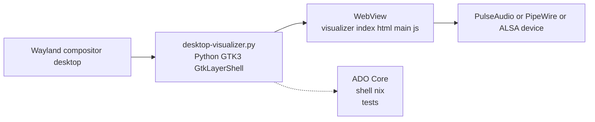
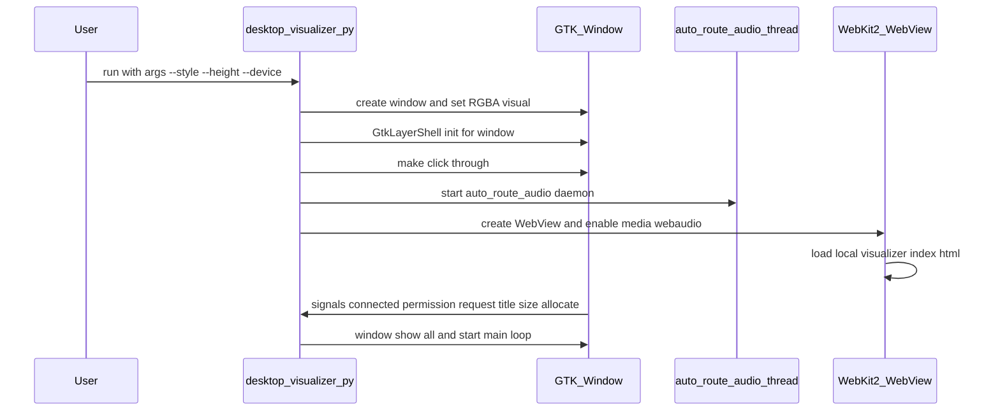
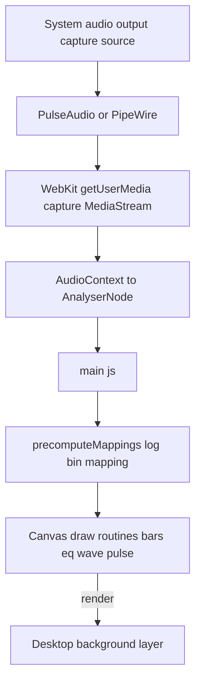
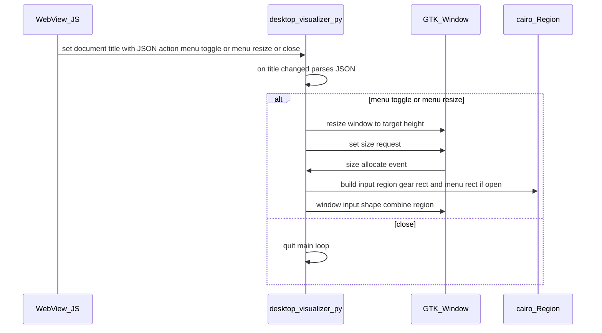
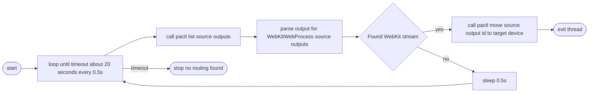

# Architecture Diagrams — Nix Audio Visualizer

This document contains Mermaid diagrams that describe the architecture and runtime flows for the nix-audio-visualizer project. Paste into any Markdown viewer that supports Mermaid (or render with a Mermaid renderer).

---

## 1) High-level architecture

---

## 2) Startup / initialization sequence

---

## 3) Audio data flow (runtime)

---

## 4) UI to Python IPC and input shape control

---

## 5) auto_route_audio daemon

---

Generated by GitHub Copilot Chat Assistant — diagrams reflect the runtime and architecture of the repository's Python host, WebView-based visualizer, and audio routing components.
