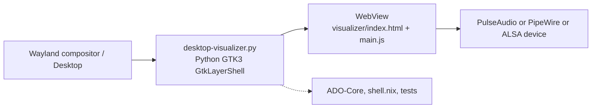
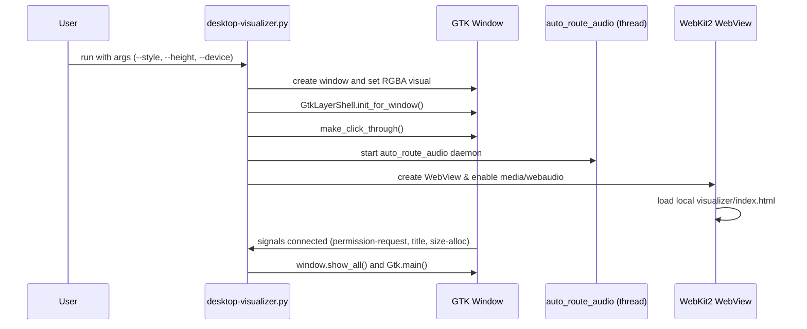
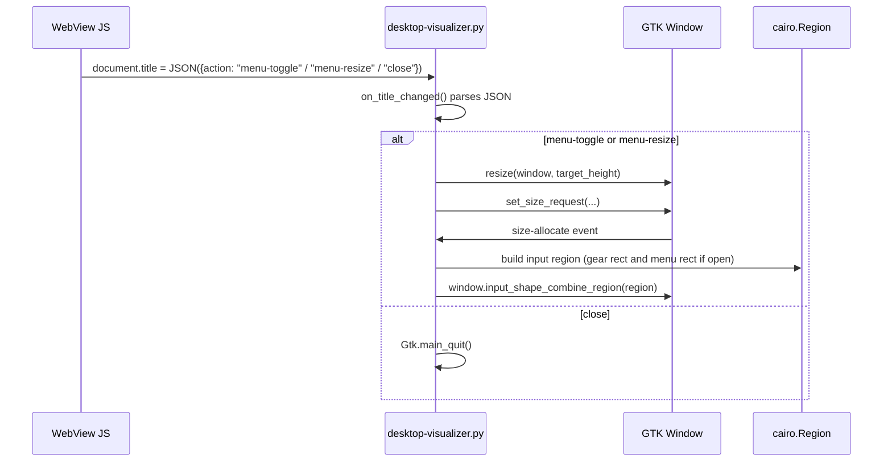

# Architecture Diagrams — Nix Audio Visualizer

This document contains Mermaid diagrams that describe the architecture and runtime flows for the nix-audio-visualizer project. Paste into any Markdown viewer that supports Mermaid (or render with a Mermaid renderer).

---

## 1) High-level architecture



---

## 2) Startup / initialization sequence



---

## 3) Audio data flow (runtime)

```mermaid
flowchart TB
  SysAudio[System audio output / capture source]
  Pul[PulseAudio or PipeWire]
  WebCapt[WebKit getUserMedia capture (MediaStream)]
  AudioCtx[AudioContext -> AnalyserNode]
  JS[main.js]
  MAPP[precomputeMappings / log bin mapping]
  Canvas[Canvas draw routines (bars, eq, wave, pulse)]

  SysAudio --> Pul
  Pul --> WebCapt
  WebCapt --> AudioCtx
  AudioCtx --> JS
  JS --> MAPP
  MAPP --> Canvas
  Canvas -->|render| Desktop[Desktop background layer]
```

---

## 4) UI ↔ Python IPC and input-shape control



---

## 5) auto_route_audio daemon

```mermaid
flowchart LR
  Start([start])
  Loop[loop until timeout (~20s) every 0.5s]
  RunP[call: pactl list source-outputs]
  Parse[parse output for WebKitWebProcess source-outputs]
  Found{Found WebKit stream?}
  Move[call: pactl move-source-output <id> <target_device>]
  Success([exit thread])
  Sleep[sleep 0.5s]
  Timeout([stop - no routing found])

  Start --> Loop
  Loop --> RunP --> Parse --> Found
  Found -- yes --> Move --> Success
  Found -- no --> Sleep --> Loop
  Loop -->|timeout| Timeout
```

---

Generated by GitHub Copilot Chat Assistant — diagrams reflect the runtime and architecture of the repository's Python host (desktop-visualizer.py), WebView-based visualizer (visualizer/), and audio routing components.
